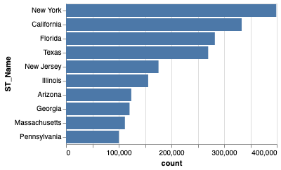
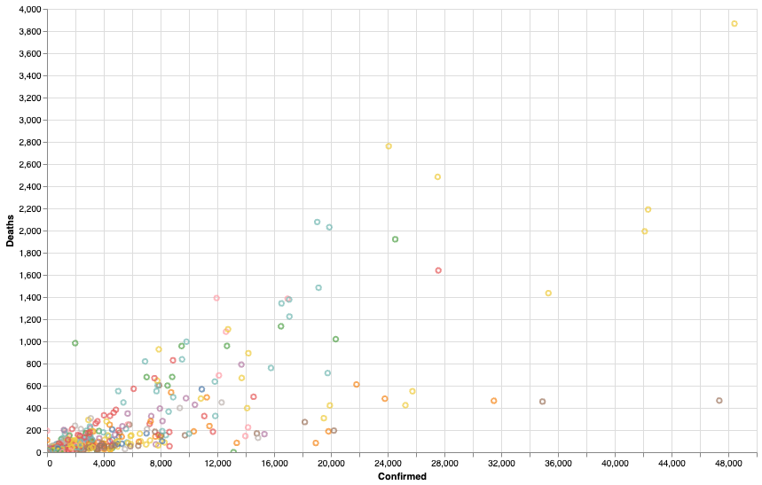

# COVID-19 Visualization & Geospatial Analysis Using Python & Altair 

## 🚀 Executive Summary
This project explores COVID-19 trends across the United States using **Python, Altair, and Jupyter Notebook**.  
Using a county-level JHU dataset, I built:

- A bar chart of the **Top 10 states** by confirmed cases  
- An **interactive scatterplot** comparing confirmed cases vs. deaths across the top 5 states  
- A **county-level choropleth map** visualizing COVID-19 fatality rates using FIPS codes  

The goal is to demonstrate declarative visualization with Altair and illustrate how interactive and geospatial views can reveal patterns in public health data.

---

## 🎯 Business Problem / Objective
Public health decision-makers need clear visuals to understand where COVID-19 cases and fatalities are concentrated and how they vary by geography.

This notebook answers:

- Which U.S. states report the highest confirmed case counts?  
- How do confirmed cases and deaths compare across the worst-hit states?  
- How are fatality rates distributed at the county level across the U.S.?

---

## 🛠 Tools & Technologies
- **Language:** Python 3  
- **Environment:** Jupyter Notebook (Anaconda)  
- **Libraries:**  
  - `pandas` – data manipulation  
  - `altair` – declarative visualization  
  - `vega_datasets` – built-in TopoJSON (U.S. counties)  
- **Data Types:** Tabular CSV, TopoJSON (geometries)

---

## 📊 Methodology

1. **Environment Setup**
2. **Data Loading & Cleaning**
   - Loaded `JHU.csv` into a pandas DataFrame  
   - Subset columns to keep only variables needed for state and county-level analysis  
   - Removed trailing null rows beyond index 3250  

3. **Top-10 States Bar Chart**
   - Grouped data by `ST_Name`  
   - Aggregated by sum of `Confirmed`  
   - Ranked states using Altair’s `rank()` and filtered to the **Top 10**  
   - Encoded state on the x-axis and confirmed cases on the y-axis as a bar chart  

4. **Interactive Scatterplot (Top 5 States)**
   - Selected the **Top 5 states** from the bar-chart results  
   - Built a scatterplot:  
     - X-axis: `Confirmed` (cases)  
     - Y-axis: `Deaths`  
   - Added:
     - `selection_single` bound to a **dropdown** of state names  
     - `alt.condition()` to highlight the selected state and gray out others  
     - `.interactive()` for zoom and pan  

5. **County-Level Choropleth Map**
   - Loaded U.S. counties TopoJSON via `alt.topo_feature(data.us_10m.url, "counties")`  
   - Used `.transform_lookup()` to join on `id` (TopoJSON) and `FIPS` (dataset)  
   - Encoded `FatalityRa` as a color scale using the **blue-purple** scheme  
   - Applied `project(type="albersUsa")` for a U.S. map projection  

---

## 📈 Visualizations

## Dataset Overview
**Source:** COVID-19 dataset provided for coursework (JHU-style county data)

Contents:

- `ST_Name` – State name  
- `Confirmed` – Confirmed COVID-19 case count  
- `Deaths` – Number of deaths  
- `FatalityRa` – Fatality rate  
- `FIPS` – County FIPS code (used to join to geospatial data)
