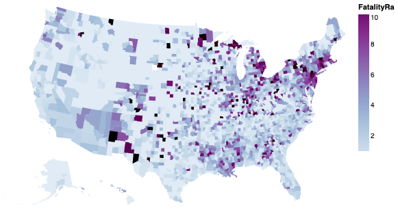

# COVID-19 Visualization & Geospatial Analysis Using Python & Altair 

## Executive Summary
This project explores COVID-19 trends across the United States using Python, Altair, and Jupyter Notebook.

The goal is to demonstrate declarative visualization with Altair and illustrate how interactive and geospatial views can reveal patterns in public health data.

---

### Business Problem / Objective
Public health decision-makers need clear visuals to understand where COVID-19 cases and fatalities are concentrated and how they vary by geography.

## **Skills**
- **Language:** Python 3  
- **Environment:** Jupyter Notebook
- **Libraries:**  
  - `pandas` – data manipulation  
  - `altair` – declarative visualization  
  - `vega_datasets` – built-in TopoJSON (U.S. counties)  
- **Data Types:** Tabular CSV, TopoJSON (geometries)

## **Methodology**

1. Environment Setup
2. Data Loading & Cleaning
3. Data Visualization

## **Visualizations**

*Findings*

- **Which U.S. states report the highest confirmed case counts?**  
  The bar chart of total confirmed cases by state shows that New York has the highest case count in this snapshot of the data, followed by California, Florida, Texas, and New Jersey. These five states make up the worst-hit group among the top-10 states in the dataset.

- **How do confirmed cases and deaths compare across the worst-hit states?**  
  The scatterplot of confirmed cases vs. deaths for the top-5 states shows a strong positive relationship: counties with more confirmed cases also tend to report more deaths. The points form an upward trend, but the spread differs by state, suggesting that some states experience higher or lower death counts relative to similar levels of confirmed cases.

- **How are fatality rates distributed at the county level across the U.S.?**  
  The county-level choropleth map reveals that fatality rates are not evenly distributed. Darker purple counties (higher fatality rates) cluster in several regions of the Northeast, Midwest, and South, while many other counties, especially in less-dense areas, show lighter shades that correspond to lower fatality rates.

## Dataset Overview
**Source:** COVID-19 dataset provided from Data Visualization coursework

Contents:

- `ST_Name` – State name  
- `Confirmed` – Confirmed COVID-19 case count  
- `Deaths` – Number of deaths  
- `FatalityRa` – Fatality rate  
- `FIPS` – County FIPS code (used to join to geospatial data)
